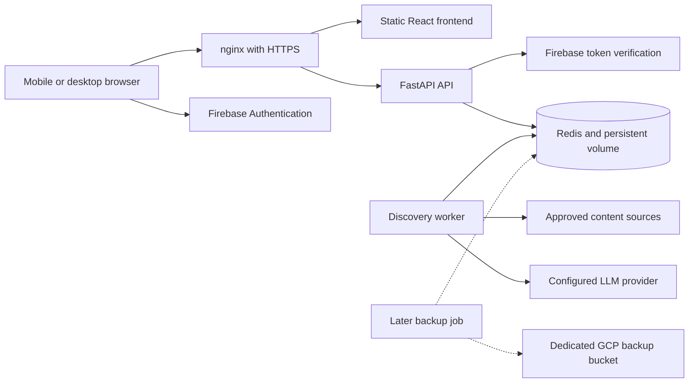

# Ataraxia architecture and data

Build a modular FastAPI application and a separate React frontend, served through nginx. Run the API, a small discovery worker, Redis, and the frontend under Docker Compose. Keep domain rules independent of HTTP, Firebase, Redis, and the LLM vendor so that they can be tested simply and changed independently.

The application serves one owner on one host. Horizontal scaling, distributed workflows, and fine-grained multi-user permissions are outside the initial scope.

## Technical decisions

| Concern | Decision | Reason and boundary |
| --- | --- | --- |
| Frontend | React, TypeScript, Vite, React Router in declarative mode | A small client application with no need for server rendering or public SEO. Vite provides the build and development server. |
| UI | CSS modules and shared CSS tokens; accessible primitives where useful | Enough structure for consistent controls, themes, and mobile layouts without a large component framework. |
| Remote state | TanStack Query | Centralize fetching, invalidation, pending state, and mutation rollback; component state handles local UI. |
| Backend | FastAPI, Pydantic, Python type annotations | Explicit request/response contracts and a thin HTTP layer over application services. |
| Storage | Redis with AOF, RDB snapshots, and a named volume | Matches the requested starting point; small data volume makes simple indexes adequate. |
| Background work | One sequential worker process from the backend image | Checks today's five slots and keeps slow external calls out of API handlers. |
| Authentication | Firebase Authentication with email/password sign-in | The owner creates the account manually; end-user sign-up is disabled and the API checks its UID. |
| Edge | nginx on one origin | Routes the frontend and API; terminates TLS at deployment. |
| Tooling | uv, npm lockfile, pytest, Ruff, mypy, Vitest, Testing Library | Familiar tools with small, behavior-focused checks. Pin supported runtime and dependency versions during implementation. |

Vite supports React/TypeScript project templates and a production build workflow. This choice avoids adding a server-rendering framework to a private client application. See the [Vite guide](https://vite.dev/guide/).

Use [React Router's declarative setup](https://reactrouter.com/start/declarative/installation) for navigation and [TanStack Query's optimistic update patterns](https://tanstack.com/query/latest/docs/framework/react/guides/optimistic-updates) for responsive habit controls with reconciliation after a save.

### Redis tradeoff

Redis is the primary database, not a disposable cache. This is workable for one person, but secondary indexes, schema changes, and exports become application responsibilities. SQLite would be a reasonable simpler relational alternative, and PostgreSQL becomes attractive if queries or users expand. Retain Redis for the initial design as requested; avoid adding a second database now.

Move storage behind a few use-case-oriented repositories. This reduces the scope of a future migration, but does not make it automatic: data export/import, migration checks, and revised integration tests would still be required.

## Runtime shape



The frontend is independently built and served in its own lightweight container. nginx is the only public service. In development nginx can route frontend requests to the Vite dev server in that container; deployment uses compiled static files. The API and worker share code and an image, but have different entry points.

Publish only nginx ports. Keep Redis and the API on private Compose networks; the API and worker still require outbound access to authentication and content providers. A named Redis volume survives container recreation. A future backup service is opt-in until its GCP setup is complete.

Readiness checks verify Redis connectivity; liveness checks verify that the process is running. Configure Compose healthchecks and dependency readiness, plus ordinary runtime reconnects. Compose startup order alone does not mean a service is ready. See [Docker startup and shutdown order](https://docs.docker.com/compose/how-tos/startup-order/).

## Code organization and responsibilities

The following is the target layout. A01 implements the API/worker entry points, shared configuration, frontend shell, and infrastructure. Domain and application modules arrive with their use cases; see [Local development](development.md) for the current commands.

```text
backend/
  src/ataraxia/
    domain/           # Habit schedules, dates, statistics, discovery entities
    application/      # Use cases and the protocols they depend on
    adapters/         # Redis, Firebase, source clients, LLM provider
    api/              # Routes, request/response models, auth dependencies
    worker/           # Scheduling and job execution
    bootstrap.py      # Construction of concrete implementations
  tests/unit/
  tests/integration/
frontend/
  src/
    app/              # Routing, providers, app shell
    features/         # Habits, discoveries, library, settings
    components/       # Reusable visual components
    lib/              # API client, authentication, date formatting
  tests/
infra/                # Compose, nginx, Redis, later backup configuration
docs/
```

Dependencies point inward: API, worker, and adapters depend on application/domain code. Domain code imports no FastAPI, Redis, Firebase, or vendor SDK. Application services take dependencies in constructors. FastAPI dependency injection wires services at the HTTP boundary; the worker uses the same composition function without HTTP machinery. [FastAPI dependencies](https://fastapi.tiangolo.com/tutorial/dependencies/) support this boundary wiring.

Use Python `Protocol` interfaces for actual external dependencies, not one interface per class. Start with these boundaries and split only when a concrete need appears:

| Protocol | Responsibility | Initial implementation |
| --- | --- | --- |
| `HabitRepository` | Habits, schedule versions, dated completions, bounded history reads | Redis hashes/documents and explicit indexes |
| `DiscoveryRepository` | Daily slots, published items, annotations, history queries, publication transaction | Redis records and sorted sets |
| `ProfileRepository` | Owner time zone and preferences | Redis document |
| `IdentityVerifier` | Turn a Firebase token into a verified identity | Firebase Admin SDK |
| `CandidateSource` | Fetch normalized candidates and bounded source material | Category-specific HTTP clients and curated seed registry |
| `DiscoveryGenerator` | Choose from supplied candidates and return typed card content and usage | One configured LLM adapter; deterministic fake in tests |
| `Clock` | UTC time and derived owner-local date | System clock; fixed clock in tests |

The content pipeline composes a category specification, source adapter, generator, validator, and repository. Share the orchestration; keep category payloads distinct. Avoid inheritance trees, a generic repository framework, or a plugin engine. Wrap the random number generator for deterministic selection tests when randomness is introduced.

Public classes, protocols, and non-obvious functions get short docstrings covering intent, inputs/outputs, and meaningful failure behavior. Types describe structure; docstrings explain decisions such as why today's incomplete habit does not break a streak. Do not restate signatures line by line.

## Domain records

Use UUIDs for application records and stable external IDs for source deduplication. Every persisted domain record has a schema version. These are conceptual fields; final validation models belong to implementation.

| Record | Essential fields |
| --- | --- |
| Profile | Firebase UID, IANA time zone, language, enabled categories, streak preference, created/updated timestamps |
| Habit | ID, owner UID, name, cue/description, color, start date, schedule versions, timestamps |
| Schedule version | Effective local date, enabled flag, selected ISO weekdays; an archive is a disabled version |
| Completion | Habit ID, local date, UTC completion timestamp; absence means incomplete |
| Daily slot | Owner UID, local date, category, state, item ID when ready, attempt count, next attempt time, bounded error code |
| Discovery item | ID, owner UID, discovery date, generation time zone, category, source identity, title, summary, typed category payload, sources, generation metadata |
| Discovery annotation | Item ID, favorite flag, read timestamp, optional reported-content concern |
| Source reference | Provider/record ID, URL, title, retrieved timestamp, attribution/license metadata where applicable, bounded supporting extract or normalized facts |
| Generation metadata | Provider/model ID, prompt version, source IDs/hash, generated timestamp, token usage, estimated cost |

Keep dates as `YYYY-MM-DD` strings and timestamps as timezone-aware UTC values. Schedule intervals run from one effective date up to, but excluding, the next. The schedule in effect on the queried date determines whether it was due. Product rules are authoritative in [Product and experience](product.md).

Published content is immutable in normal user flows; favorites and read state change separately. A future correction tool may record a corrected revision, but normal retry cannot silently overwrite an archived card. Export includes profiles, schedules, completions, items, sources, and annotations.

## Redis representation and durability

Use core Redis types; no Redis modules are needed. Illustrative keys:

| Key family | Representation |
| --- | --- |
| `ataraxia:v1:u:{uid}:profile` | JSON string |
| `...:habits` and `...:habit:{id}` | ID set and JSON habit document |
| `...:habit:{id}:completions` | Hash from local date to completion record |
| `...:daily:{date}` | Hash from category to slot document |
| `...:item:{id}` and `...:annotation:{id}` | JSON documents |
| `...:history` and `...:history:{category}` | Sorted sets of item IDs by discovery date ordinal |
| `...:seen:{category}` | Source identity set to suppress repeated selections |

The single worker reads today's category slots directly. A slot's state and next attempt time are sufficient to find work; no separate job index, queue, or lease records are needed.

History uses a stable `(date, item_id)` cursor, so categories published on the same day are not skipped at page boundaries. For a single user's collection, search can filter bounded batches from the date index without adding a search engine. Cap page size and return the next cursor. Add indexes only when real response times justify them.

Durable records and history have no TTL; disposable source caches can expire. Use Redis transactions for related writes; use `WATCH` with a small bounded retry where a read must be conditional. Publishing an item, attaching it to its daily slot, recording its source identity, and updating history are one repository operation. No external API calls occur inside a transaction.

Completion uses explicit set/delete operations on its unique habit/date field. It is naturally idempotent. Writes to existing records must check ownership using the authenticated UID, not an owner identifier supplied in the request.

Persistence configuration is part of the first storage implementation:

- Enable AOF with `appendfsync everysec` and regular RDB snapshots.
- Mount Redis data on a persistent named volume.
- Set a bounded memory allowance with `maxmemory-policy noeviction`; exhausted capacity produces a visible write failure rather than deleting history.
- Monitor persistence errors, available disk, and memory with simple logs/health status. Do not treat a successful container restart as proof of off-host recoverability.

AOF records writes; RDB provides snapshots suitable for backup. The `everysec` setting accepts a small recent-write loss window on a crash and does not protect against host loss. This is an accepted starting tradeoff. See [Redis persistence](https://redis.io/docs/latest/operate/oss_and_stack/management/persistence/). Off-host backup and restore requirements are in [Delivery and operations](delivery.md).

Store small normalized records in Redis, not artwork image bytes or full paper PDFs. At first, images are remote URLs with attribution; broken images do not destroy the saved textual card. History does not promise a permanent offline copy of external media.

Use explicit schema migrations when records change. A small versioned migration command with a pre-migration snapshot is sufficient; do not introduce a schema management framework before it is needed. The application should fail clearly on a newer unsupported data schema.

## API outline

All application routes are under `/api/v1` and require an authorized identity. The infrastructure-only `/api/health/live` and `/api/health/ready` routes are public and contain only a status. A01 has no application routes yet. `GET` requests do not start paid generation. Derive the UID from verified authentication and the current local date from the stored profile.

| Endpoint family | Behavior |
| --- | --- |
| `GET/PATCH /me` | Read/update preferences, including validated time zone |
| `GET/POST /habits` | List or create habits |
| `PATCH /habits/{id}` | Edit fields or schedule; archive/restore through an enabled flag |
| `GET /habits/{id}/calendar?month=YYYY-MM` | Due/completed states and statistics for a bounded month |
| `PUT /habits/{id}/completions/{date}` | Ensure complete; return authoritative state and affected statistics |
| `DELETE /habits/{id}/completions/{date}` | Ensure incomplete; same ownership/date validation |
| `GET /today` | Current local date, due habits, progress, and daily slot summaries |
| `GET /discoveries/daily?date=YYYY-MM-DD` | Read existing cards/status for a date |
| `POST /discoveries/daily/ensure` | Queue missing current-day slots; idempotent and bounded |
| `POST /discoveries/daily/{category}/retry` | Retry an eligible failed current-day slot within shared limits |
| `GET /discoveries` | Paginated history with category, date, favorite, and text filters |
| `GET /discoveries/{id}` | Full saved card and sources |
| `PATCH /discoveries/{id}/annotation` | Set favorite/read state or flag a content concern |
| `GET /export` | Download versioned JSON of the owner's durable records |

Return consistent errors with an application code, concise message, optional field details, and request ID. Use 401 for invalid/missing identity, 403 for a valid unauthorized identity, 404 for inaccessible records, and validation/conflict responses for disallowed dates or states. Generation requests normally return 202 with slot status; polling reads status without another generation request.

Generate frontend API types from FastAPI's OpenAPI schema during the build workflow. Keep UI view models separate when they improve readability. Do not duplicate habit statistics in TypeScript: the backend is authoritative, while the UI formats and displays the results.

## Authentication and basic security

Use Firebase email/password authentication with a single account created manually by the owner in the Firebase console. Enable only the email/password provider and disable end-user account creation in Authentication Settings. See Firebase's [manual account creation](https://support.google.com/firebase/answer/6400802?hl=en) and [user self-service controls](https://firebase.google.com/docs/auth/users#user_self-service).

The app presents an email/password form using `signInWithEmailAndPassword`, and a sign-out action. The Firebase browser SDK manages session persistence and token refresh. Registration, invitations, and account-management screens are outside the app; the owner handles password resets and maintenance through Firebase administration. Credentials go directly to Firebase rather than through the application's API. See [Firebase password sign-in](https://firebase.google.com/docs/auth/web/password-auth).

Send the current Firebase ID token in the Authorization bearer header. The backend verifies it for this application's Firebase project and requires its UID to equal `OWNER_FIREBASE_UID`, configured from the manually created account. An unset owner UID fails closed; the first sign-in cannot claim ownership. A valid token for another UID grants no profile, habits, content, or generation access. [Firebase token verification](https://firebase.google.com/docs/auth/admin/verify-id-tokens) describes the Admin SDK flow.

During setup, verify the provisioned account can sign in and end-user registration is rejected by Firebase. This password flow needs no OAuth redirects or nginx auth-helper routes. Manually check sign-in, session persistence, and sign-out on a phone.

Use HTTPS outside local development, same-origin API requests, input length/date-range limits, and a conservative rate limit on generation endpoints. Render generated content as escaped text or a restricted Markdown subset; do not render raw source HTML. Source fetchers use approved HTTPS hosts and check redirects rather than fetching arbitrary model-supplied URLs.

Keep Firebase service credentials and LLM keys on the server. Public Firebase browser configuration is distinct from service credentials. Do not log tokens, personal habit text, or full prompts by default. Habit details never enter content prompts. Local development can use the Firebase emulator in a Compose profile; test identity overrides must fail closed outside the explicit test/development configuration.

The repository, Compose project name, secrets, auth project, and future cloud resources are separate from Osmy. Do not reuse ambient credentials or infer this app's GCP project from the surrounding machine.
