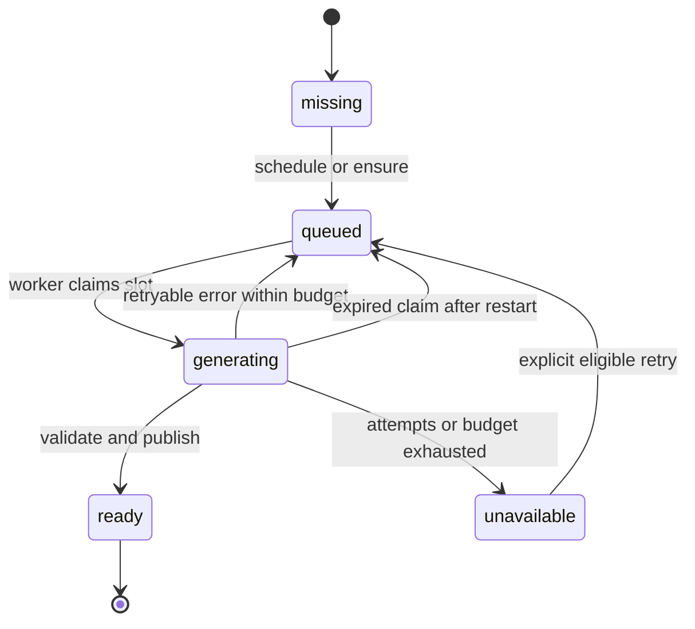

# Ataraxia daily discoveries

Publish one discovery per enabled category per owner-local day. Each card combines a real source record with a concise LLM explanation, then becomes a stable part of the personal Library. Habits and previously saved cards remain usable when generation or a source provider is unavailable.

The LLM selects and explains; source adapters supply identities, dates, links, and supporting material. This keeps selection varied without depending on the model to invent a valid artwork URL or remember a paper accurately.

## Content sources and selection

| Category | Initial sources and candidate supply | Selection and limits |
| --- | --- | --- |
| Word | A checked-in list of useful English lemmas, with Wiktionary sense lookup and a small validated fallback set | Prefer words useful in speech or writing; vary difficulty and register. The LLM selects a supplied sense and writes original examples. |
| Artwork | Metropolitan Museum of Art collection records, supplemented by a small curated registry of works from other institutions | Rotate medium, culture, period, and artist where metadata permits. Use source-provided images only when display rights are established; otherwise show the source link and text. |
| History | Wikimedia's on-this-day events and linked articles; curated source-linked events for fallback | Prefer an event on today's month/day, then fall back to a general historical event with an explicit label. Vary region, period, and subject. |
| Mind | Europe PMC literature metadata/abstracts and a small curated registry of authoritative educational articles and review papers | Rotate cognition, emotion, perception, sleep, disease, development, and psychedelics. Prefer review-level material for broad claims. |
| ML paper | arXiv metadata/abstracts in ML-related categories and a curated list of foundational papers | Start with roughly 70% recent work from a rolling 90-day pool and 30% older foundations. This is a selection preference, not a quota or quality score. |

The word adapter obtains an English sense from a known lemma using the [MediaWiki parsing API](https://www.mediawiki.org/wiki/API:Parsing_wikitext), then strips unrelated markup and bounds the text. Seed data includes source links and provenance; do not ship copied dictionary text without its required attribution and license information. Preserve the applicable [Wiktionary license](https://en.wiktionary.org/wiki/Wiktionary:CC-BY-SA) metadata with reused material. Implement a small adapter fixture test because dictionary markup can vary.

The Met API exposes collection metadata, public-domain status, and image URLs. Use the API's actual record fields, preserve approximate dates, and leave unknown attribution unknown. See the [Met Collection API](https://metmuseum.github.io/). The initial source coverage is finite and biased toward available collections; the product imposes no restriction to paintings, a particular artist, or a particular era. Curated additions keep contemporary work and other collections possible without building many adapters at once.

Wikimedia documents an [on-this-day feed](https://wikitech.wikimedia.org/wiki/Wikifeeds). Fetch its linked article material when the event snippet alone does not support the desired explanation. Retain attribution and source revision information when available. An event's historical date is distinct from its discovery date; do not label uncertain or approximate dates “On this day.”

Europe PMC is the proposed literature adapter for the mind category; its [web service documentation](https://europepmc.org/RestfulWebService) describes publication search and metadata access. Confirm the chosen endpoint and response fields in the adapter implementation issue. Use curated sources as the initial fallback, so this integration does not block the rest of the app.

The arXiv API returns titles, authors, abstracts, dates, categories, and paper links. Keep the canonical paper ID for deduplication and the retrieved version ID for provenance. A new version is not automatically a new daily paper. See the [arXiv API manual](https://info.arxiv.org/help/api/user-manual.html). Cache query results and follow [arXiv API terms](https://info.arxiv.org/help/api/tou.html), including request pacing, rather than polling for each page view.

Curated registries contain source records, not an unlimited stock of completed cards. The LLM still performs daily selection and explanation. Start with a small fallback set, around five to ten candidates per category, and document how to replenish or extend it. Live adapters provide the main ongoing supply. Notify through logs/settings when unseen candidates run low; do not silently repeat the same small pool.

## Variety and repeat suppression

Normalize candidates to a stable category/source identity: word plus language and sense, museum object ID, historical event identity, mind topic/source pair, or canonical paper ID. Published identities enter the owner's seen set. Normalize cross-provider aliases for curated records when known; occasional semantic overlap is acceptable for a side project.

Prefer unseen candidates and underrepresented topics from recent history. Build a small varied candidate batch with a seeded random sampler, then ask the LLM to select one. Random sampling prevents the same high-profile item always winning; the LLM provides relevance and a readable explanation. Store the selected identity and selection metadata for debugging.

Do not promise perfect diversity or universal coverage. Exact repeats are excluded while unused candidates are available. If the pool is exhausted, expand/refetch within the normal limits or leave the slot unavailable. Later recall features can deliberately revisit old cards with a review label.

The app initially uses broad English content and general ML interests. Topic weighting can be added after use reveals preferences. Do not infer psychological traits or medical conditions from habit history.

## Generation pipeline

1. Determine the owner-local date and category. Return the existing ready slot if one exists.
2. Load a bounded candidate batch, excluding seen identities. Resolve source records before prompting; reuse cached records where appropriate.
3. Give the generator normalized source facts/extracts, approved source IDs, output schema, desired length, and category-specific instructions. Send no habit records or Firebase identity.
4. Make one model call to select a candidate and return the structured card. The selected source ID must belong to the input set.
5. Validate schema, required fields, allowed source IDs, date labels, supplied metadata, links, length, and category-specific constraints. Resolve outgoing links from the source adapter's data, not free-form model URLs.
6. Publish atomically: immutable item, daily slot, history index, and seen identity. A refresh or subsequent request reads the same item.

The shared generator returns a discriminated payload for the five card types, source references, and usage information. Keep prompts versioned alongside code. Provider credentials and SDK objects stay inside the adapter. Choose one inexpensive model with structured output support during implementation; do not build multiple live integrations up front. Fixtures make local work independent of that choice.

External content is data, not instructions. The generator cannot run tools, follow source-page commands, write Redis, or fetch arbitrary URLs. Source clients enforce host allowlists, HTTPS, redirect checks, timeouts, response size limits, and bounded extraction. The frontend renders the resulting content safely.

## Content quality boundaries

Link validation and a valid schema do not establish factual correctness. Reduce errors through source-grounded prompts, preserved evidence, conservative wording, and a small manual quality check before enabling each category. No second-model judge or broad evaluation platform is needed initially.

| Category | Required checks and wording |
| --- | --- |
| Word | Definition matches the chosen sense; examples use that sense naturally; mark uncommon, formal, or dated usage when supported. Examples are original generated sentences. |
| Artwork | Copy artist, title, date, and medium from records. Interpretations are identified as interpretations. If the model receives only text metadata, it must not invent visual details; use a general viewing prompt or source-supported observation. |
| History | Preserve the actual event date, distinguish documented fact from disputed interpretation, and avoid inflated single-cause explanations. |
| Mind | Identify human versus animal evidence and review versus individual study when relevant. Avoid turning association into causation or a single finding into established consensus. Explain uncertainty beside the claim. |
| ML paper | Preserve bibliographic facts; describe what the supplied abstract supports. Label “Based on the abstract” when full text was not read. Do not invent benchmarks, implementation details, limitations, or a peer-review status. |

Mind cards can discuss brain diseases, mental health, and psychedelics as science. They should not give individualized diagnosis, treatment changes, or dosing guidance. Present useful everyday connections without converting tentative findings into prescriptive “brain hacks.” This is a scope boundary, not a banner to repeat on every card.

Use a brief source list, a content-type label where it affects interpretation (for example, “preprint” or “review”), and an optional “Report an issue” action. This action flags the local card for later inspection; it does not send a message to anyone. Generated summary text is distinguishable from quoted source text. Keep licensing/attribution metadata with content and do not store full articles by default.

## Scheduling and recovery

The worker runs as one long-lived Compose service and checks for due work about once a minute. Default scheduled generation is 05:00 in the owner's configured time zone. The owner can open the app earlier: an explicit `ensure` request queues missing current-day slots immediately. First setup may also queue today's slots.

On startup, reconcile the current day. After 05:00, queue its missing enabled slots; before 05:00, process only work already requested. Do not generate a backlog for days when the host was offline. Published cards from unattended days remain in Library, but unread items never form an obligation. If the owner disables a category, cancel its unpublished work while retaining ready cards.

Close unstarted jobs for dates before today as unavailable. A generation already in progress at midnight may finish under its original date; it does not become today's card. This keeps restart recovery from creating an expensive catch-up run.

Jobs are uniquely identified by owner/date/category and stored durably in Redis. Store a due-time index and per-slot status. No separate queue server, Celery deployment, or in-process FastAPI background job is necessary.

Use a short-lived claim token with a lease longer than the bounded attempt timeout. Reclaim expired work after a crash. Finalization verifies that the claim still belongs to the worker and that the slot is not already ready. Count attempts before external calls. This prevents ordinary duplicate publications; it does not promise exactly-once external billing across crashes.

Allow at most two LLM calls per category/day, including output repair, retries, and manual retries. Use bounded backoff for transient provider errors and source fetches. Manual retry does not reset spent attempts or costs. A capped slot can become eligible if an operator deliberately increases the limit; the normal UI cannot override it. No “reroll” action exists for a ready card in the initial release.

The UI polls only while current slots are queued/generating, with a short bounded polling window and a manual refresh thereafter. Stop polling in the background. If a worker is unavailable, habits and history still work and the UI describes the pending content honestly.

## Spending and observability

Five categories with one call each is about 150 generation calls in a 30-day month, or at most 300 under the default retry limit. These are call counts, not price estimates. Model choice, input sizes, output tokens, and any paid source access determine actual spend.

Set input/output token limits, `MAX_LLM_CALLS_PER_DAY` (initially 10), and a daily estimated spending ceiling before regular use. Check a conservative per-call cost reservation before dispatch and reconcile it with reported usage. Keep the provider's own account spending controls as a second boundary when available. Requests with uncertain billing after a timeout retain their reservation. Exceeding the limit stops new generation, not habit tracking or reading.

Log category, slot/job ID, duration, attempts, result code, source count, tokens, and estimated cost. Keep prompts, source extracts, and user text out of ordinary logs. Store the minimum provenance needed to understand a saved card and reproduce a failure with fixtures. Prune routine job diagnostics on a short retention period; never expire the user's published history.

Before enabling the real provider, manually inspect a few cards per category for readable prose, correct attribution, supported claims, sensible variety, and reliable links. Store representative sanitized provider responses as parser fixtures rather than snapshotting exact LLM wording in tests.
